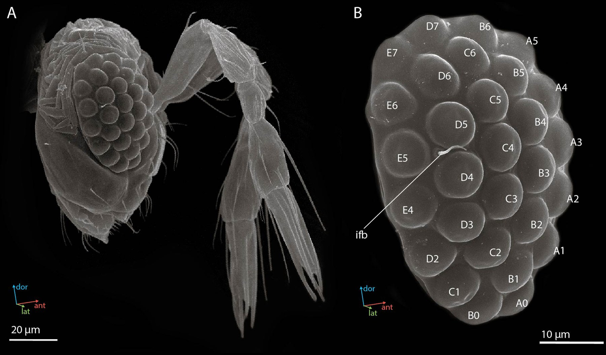

# Acquisition Brief — Vigilia Connectome

**Date:** 2026-09-22  
**Repository:** https://github.com/theworker02/magaphragma-connectome  
**Default branch:** `main`  
**Primary language:** Python  
**Status:** Diligence briefing only. **No acquisition has occurred** by virtue of this file.  
**License:** Proprietary — sale, written commercial license, or completed asset transfer required (see root `LICENSE`).  
**Valuation:** Not stated.  
**Contact:** GitHub [@theworker02](https://github.com/theworker02) · [thanks.dev/u/gh/theworker02](https://thanks.dev/u/gh/theworker02)

> Cloning or forking this repository does **not** grant production, redistribution, SaaS, OEM, or commercial rights.

---

## 1. Executive thesis

This project is **proprietary**. Production use, redistribution, and commercial deployment require a written commercial license or completed acquisition. See [LICENSE](./LICENSE) and [ACQUISITION.md](./ACQUISITION.md). Contact [@theworker02](https://github.com/theworker02).  <p align="center"><em>Megaphragma viggianii</em> — female head and compound eye (SEM).<br />

**Why a buyer cares:** Vigilia Connectome packages transferable product IP — source, docs, in-repo brand assets, and a diligence room under `docs/acquisition/` — under a clear proprietary posture so diligence can proceed without mistaking the repo for open source.

---

## 2. Product snapshot

| Item | Detail |
|------|--------|
| Product | Vigilia Connectome |
| Repo | `theworker02/magaphragma-connectome` |
| Language | Python |
| Open source? | **No** — proprietary |
| Rightsholder | theworker02 |
| Diligence pack | `docs/acquisition/` |

### Capability highlights (from current materials)

- Total chunks: **28,798**
- Completed locally: on the order of **~200–240** affinity chunks
- Remaining: **~28.5k**
- That is not a failed experiment. That is a **partially drained production queue** stopped before the money and machine-time required to finish it.
- Not “the method doesn’t work.”
- Not “the volume can’t be processed.”
- Not “we abandoned evidence discipline.”
- Not a polished fake demo with invented neurons to look finished.
- **Source, ingestion, and Phase 2:** declared sources, checksums, local ingestion receipts, coordinate metadata, and bounded DVID navigation form a trustworthy local starting point. The cache is still non-release-eligible.
- **CATMAID-local / Phase 4:** source records may be cached and analysed locally with their source identity preserved. This does not establish CATMAID-to-DVID correspondence or release rights.
- **Phase 5C production-domain planning:** the reported parent extent is indexed as a resumable denominator for future work. It does not state that multi-terabyte imagery has been acquired.
- **Ground truth, annotation crops, and G2:** DVID-native plans are split-safe and buffer-aware. Review-created affinity targets are sparse direct supervision, not dense instance labels.

---

## 3. Problem / opportunity

Teams evaluating Vigilia Connectome typically need either (a) a commercial right to run or embed it, or (b) outright ownership of the Product IP for strategic build-out. Public GitHub visibility without a proprietary license creates false assumptions about free production use. This brief and the linked data room make the commercial path explicit.

---

## 4. What ships today

Honest maturity: treat repository contents, README claims, tests, and release tags as the source of truth. Do not assume production customers, ARR, filed patents, or SLAs unless separately evidenced in diligence.

Typical transferable surfaces:

- Source tree and build/test scripts present in-repo
- Documentation and design notes
- Acquisition / diligence markdown under `docs/acquisition/`
- Branding assets committed to the repository (if any)

---

## 5. Demo / evaluation path (buyer)

Minimal path (no secrets required unless README says otherwise):

``` bash
git clone https://github.com/theworker02/magaphragma-connectome.git
cd magaphragma-connectome
# Follow README for language-specific install / run steps
```

Extended evaluation: `docs/acquisition/BUYER_EVALUATION.md`. Written NDA / evaluation grants may be required for private materials.

---

## 6. What a transaction typically includes

Subject to definitive schedules:

| Included (typical) | Excluded (typical) |
|--------------------|--------------------|
| Repo materials + asserted original IP | Seller personal accounts / unrelated repos |
| Docs + diligence room at closing | Third-party dependency source under separate licenses |
| In-repo brand marks as assigned | Secrets without rotation plan |
| Know-how captured in docs | Fabricated revenue, user, or adoption metrics |

---

## 7. Suggested deal structures

| Structure | When it fits |
|-----------|--------------|
| Non-exclusive commercial license | Deploy/run under seat or environment terms |
| Exclusive field-of-use license | Buyer wants exclusivity; seller may retain entity |
| Asset / IP assignment | Buyer wants ownership of Materials outright |
| OEM / redistribution | Separate agreement — not implied here |

Commercial terms (price, earnouts, escrow) are negotiated under NDA with counsel.

---

## 8. Buyer diligence checklist

- [ ] Confirm Rightsholder identity and authority to sell/license
- [ ] Inventory Materials (`docs/acquisition/ASSET_INVENTORY.md`)
- [ ] Review IP posture (`IP_PROVENANCE.md`) and dependencies (`DEPENDENCY_INVENTORY.md`)
- [ ] Run evaluation script (`BUYER_EVALUATION.md`)
- [ ] Review risks (`RISK_REGISTER.md`)
- [ ] Agree transfer scope (`TRANSFER_MANIFEST.md`) and handoff (`HANDOFF_CHECKLIST.md`)
- [ ] Supersede root `LICENSE` at closing via definitive agreement

---

## 9. Related documents

| Document | Purpose |
|----------|---------|
| `LICENSE` | Proprietary — no default grant |
| `docs/acquisition/README.md` | Data-room index |
| `docs/acquisition/EXECUTIVE_SUMMARY.md` | One-page thesis |
| `README.md` | Product overview |
| `SECURITY.md` | Vulnerability reporting |
| `COMMERCIAL.md` | Licensing contact path |
| `.github/FUNDING.yml` | Sponsors / thanks.dev |

---

## 10. Disclaimer

This package is informational and **does not** create a binding offer, grant of rights, or investment advice. Engage counsel for any transaction.

---

*Document version: 2.0.0 / 2026-09-22 · Classification: acquisition briefing*
