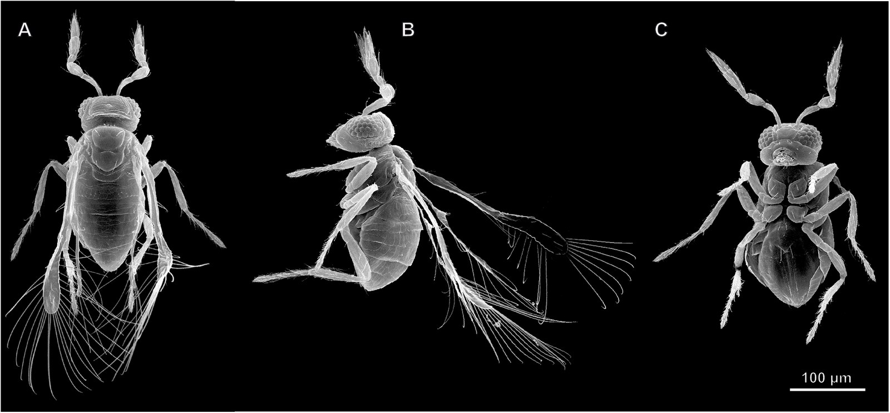
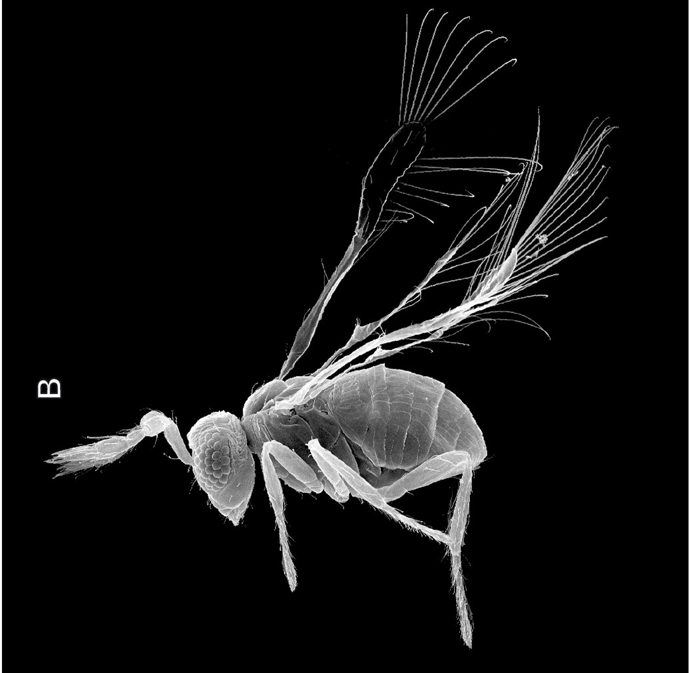
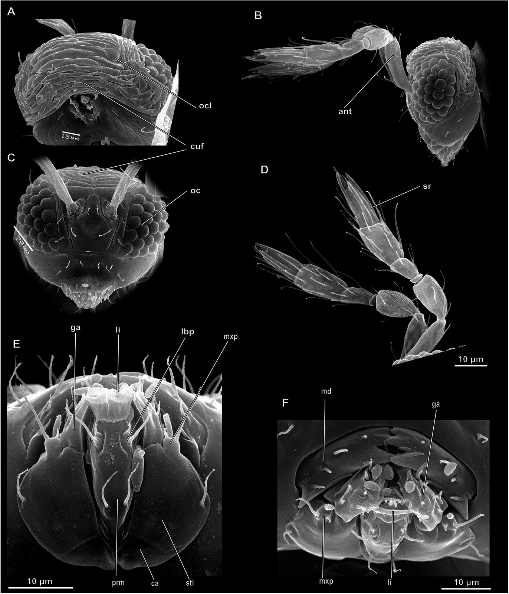
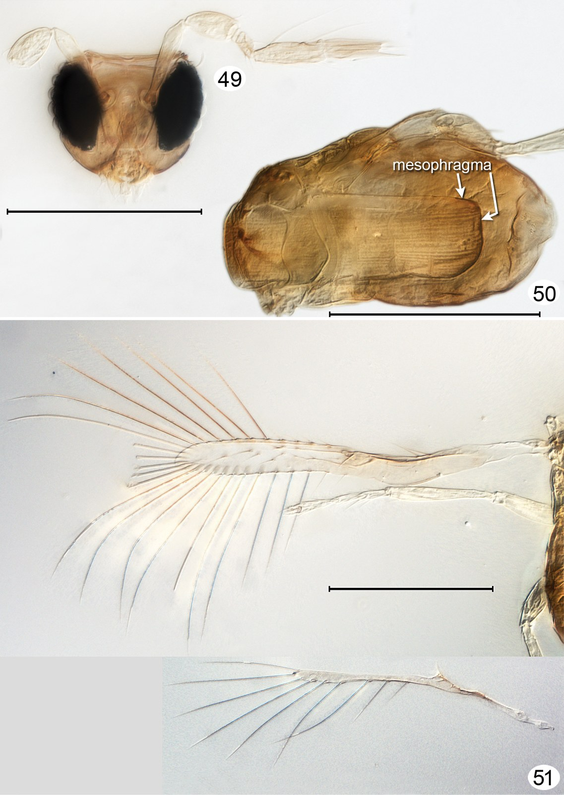
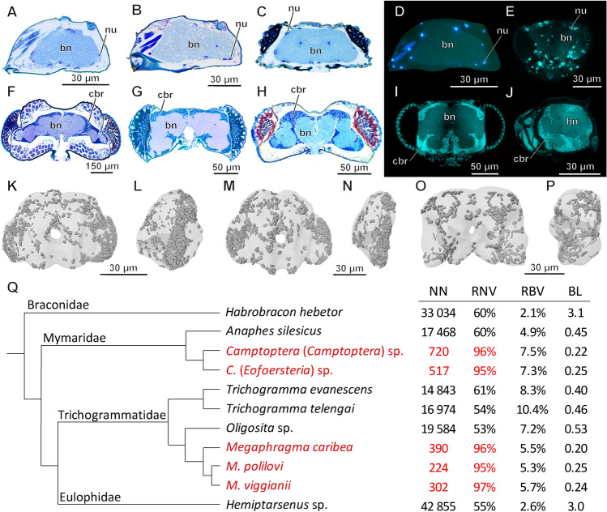

# Vigilia Connectome

---

## License & acquisition

This project is **proprietary**. Production use, redistribution, and commercial deployment require a written commercial license or completed acquisition. See [LICENSE](./LICENSE) and [ACQUISITION.md](./ACQUISITION.md). Contact [@theworker02](https://github.com/theworker02).

  

<em>Megaphragma viggianii</em> — female head and compound eye (SEM). 
Makarova et al., <em>eLife</em> (2025), Fig. 1 · <a href="https://creativecommons.org/licenses/by/4.0/">CC BY 4.0</a> ·
<a href="https://doi.org/10.7554/eLife.103247">doi:10.7554/eLife.103247</a>

> **Takeover handoff — unfinished but substantial.**  
> Most of the heavy lifting is done (evidence core, Affinity S7 FAST path, Vast/local hybrid tooling, AWS Affinity decommissioned). The full-volume affinity campaign (~28.8k chunks) is **not** finished. **I did not stop because the science failed, the approach was wrong, or the codebase ran out of road.** I stopped because **resources ran out**: cloud budget, out-of-pocket AI/compute spend, and the wall-clock cost of finishing a multi-terabyte EM affinity campaign alone. If you have GPU hours, EM collaboration, or funding to continue, start with **[HANDOFF.md](HANDOFF.md)**. This GitHub tree is intentionally **lean**: no secrets, no multi-GB affinity dumps, no checkpoints.

## Evidence-first infrastructure for the *Megaphragma viggianii* connectome

Vigilia Connectome is local-first research infrastructure for creating a defensible connectome of the miniature parasitoid wasp ***Megaphragma viggianii*** — only when every supporting datum, coordinate transform, model output, review decision, and release claim can be traced and independently inspected. It is not a synthetic-connectome demo, a generic graph viewer, or a pipeline that treats a convincing model mask as biology.

The central design decision is simple: a plausible result is not automatically a biological result. Raw imagery, local caches, published source annotations, machine predictions, human-review events, and release-eligible biological entities remain separate artifacts with explicit transitions between them. A missing source, checksum, rights statement, transform, or review is visible evidence of uncertainty—not a blank to be filled with inference.

> **Current status:** No Vigilia biological reconstruction release exists. The repository contains no invented neurons, synapses, connectivity edges, segmentation outputs, or demonstration biological metrics. Local research artifacts are not evidence of redistribution permission, cross-dataset registration, or scientific-release eligibility.

---

## Meet the animal

*Megaphragma* is a genus of fairyfly wasps (Trichogrammatidae) among the smallest insects with a complex nervous system. Adults are on the order of a few hundred micrometres long — comparable to some single-celled organisms — yet they still fly, sense, and behave. *M. viggianii* is the species this project targets: published whole-head serial EM, a complete early-visual-system / lamina reconstruction (Chua et al., 2023), WASPSYN synapse benchmarks (Li et al., 2024), and subsequent eye morphofunctional mapping (Makarova et al., 2025).

That extreme miniaturization is exactly why the connectome problem is interesting — and why finishing it is expensive. The source domain reported for production planning alone is on the order of **16,648 × 13,544 × 15,401** voxels at **8 nm** isotropic. Affinity inference over that volume was planned as a **28,798-chunk** resumable campaign. The software and fleet tooling to run that campaign exist; the unpaid GPU-months to drain the queue do not.

### The target species — *Megaphragma viggianii*

  

<strong>Above:</strong> SEM of a female <em>M. viggianii</em> head (A) and compound eye (B). The eye has <strong>29 ommatidia</strong> (labeled as in Chua et al., 2023); scale bars 20 µm / 10 µm.
Credit: Makarova et al., <em>eLife</em> 2025 · <a href="https://creativecommons.org/licenses/by/4.0/">CC BY 4.0</a>.

### Same genus, whole-animal scale — *Megaphragma mymaripenne*

High-quality whole-body SEMs of *M. viggianii* under verified open licenses are scarce, so the gallery also includes *M. mymaripenne* (same genus) to show what these animals look like at full-body scale. Body length is on the order of **~200 µm** (see 100 µm scale bar).

  

<strong>Above:</strong> External morphology of <em>M. mymaripenne</em> (SEM) — dorsal (A), lateral (B), ventral (C). Scale bar 100 µm.
Alexey A. Polilov · <em>PLoS ONE</em> 2017 · <a href="https://creativecommons.org/licenses/by/4.0/">CC BY 4.0</a> · <a href="https://doi.org/10.1371/journal.pone.0175566">doi:10.1371/journal.pone.0175566</a>.

  
&nbsp;&nbsp;
  

<strong>Left:</strong> Lateral whole-animal view (fringed fairyfly wings). 
<strong>Right:</strong> Head / antennae / mouthparts SEM montage. 
Same Polilov 2017 source · <a href="https://creativecommons.org/licenses/by/4.0/">CC BY 4.0</a>.

### Light microscopy — *Megaphragma* sp.

  

<em>Megaphragma</em> sp. uncleared slide montage — head + antenna, mesosoma (note large mesophragma — the genus name), wings + middle leg. Scale line = 100 µm.
Huber &amp; Noyes, <em>J. Hymenoptera Research</em> 2013 · <a href="https://creativecommons.org/licenses/by/3.0/">CC BY 3.0</a> ·
via <a href="https://commons.wikimedia.org/wiki/File:Megaphragma.jpg">Wikimedia Commons</a>.

### Why the brain is famous (and hard)

  

Comparative brain morphology across miniature Hymenoptera, including <em>M. viggianii</em>. Several <em>Megaphragma</em> lineages are known for extreme neuronal miniaturization (including loss of nuclei in many brain neurons in adults).
Open-access figure · <a href="https://www.ncbi.nlm.nih.gov/pmc/articles/PMC10017799/">PMC10017799</a> · <a href="https://creativecommons.org/licenses/by/4.0/">CC BY 4.0</a>.

Full figure credits and license notes: **[figures/organism/ATTRIBUTION.md](figures/organism/ATTRIBUTION.md)**. Upstream microscopy and reconstruction **data** still follow [DATA_LICENSES.md](DATA_LICENSES.md) — open figure licenses are not a grant to redistribute raw EM volumes.

---

## Why this repository is unfinished (resource stop, not scientific stop)

This section is the honest part of the handoff.

### What “done enough to hand off” already means

| Delivered | Meaning |
| --- | --- |
| Evidence-first core (`src/mvconnectome/`) | Typed records, provenance, gated promotion from machine → review → biology |
| Phase 5C production domain | Deterministic **28,798**-item resumable queue over the reported parent extent |
| Affinity training / qualification funnel | Parallel funnel + GATE_A–E contracts; checkpoint path established |
| Affinity S7 FAST inference | Workers, claim coordination, durable commit, progress tooling |
| Vast.ai production cloud path | `tools/affinity_vast.py`, budgets, offer plan/launch/stop |
| Local AMD ROCm worker | Free concurrent worker on the **same** shared claim queue |
| AWS Affinity path | **DECOMMISSIONED** on purpose — [docs/AWS_DECOMMISSION.md](docs/AWS_DECOMMISSION.md) |
| Contracts / receipts | Large JSON evidence set under `experiments/phase6e/` (kept in git) |

Last recorded S7 snapshot on the originating machine (indicative only; this checkout does **not** include chunk binaries):

- Total chunks: **28,798**
- Completed locally: on the order of **~200–240** affinity chunks
- Remaining: **~28.5k**
- That is not a failed experiment. That is a **partially drained production queue** stopped before the money and machine-time required to finish it.

### What forced the stop

I was **only forced to stop because of resources** — not because the pipeline collapsed, not because the biology was unreachable, and not because the evidence rules were wrong.

1. **Hard cloud budget.** Production Affinity cloud spend is gated at **`$160` USD** (`AFFINITY_CLOUD_BUDGET_USD`), with preferred target **`$100`** and benchmark-only **`$5`**. The cost model optimizes **dollars per completed production chunk**, not GPU prestige. Details: [docs/AFFINITY_COST_MODEL.md](docs/AFFINITY_COST_MODEL.md), [docs/VAST_AFFINITY.md](docs/VAST_AFFINITY.md), [docs/HYBRID_FLEET.md](docs/HYBRID_FLEET.md).

2. **Out-of-pocket AI / tooling spend.** Building through blockers already cost roughly **`$160` USD** in AI credits alone (see [SUPPORT.md](SUPPORT.md)). That is separate from GPU rental. Continuing at the same intensity without sponsorship is not sustainable for a solo maintainer.

3. **Compute reality of the remaining campaign.** ~28.5k chunks remain. Local ROCm helps (free concurrent worker), but finishing the queue still needs either a long unpaid local campaign, paid Vast capacity under the hard ceiling, or a new backer / collaborator who can absorb GPU-hours.

4. **Artifact size vs GitHub.** The Affinity checkpoint used by fleet docs (~460 MB) and multi-GB chunk outputs are **not** in this tree by design. Lean handoff was required so someone else can resume without inheriting secrets or undifferentiable binary dumps.

5. **No EM partner yet.** Rights, redistribution, and next open bug-brain releases need an electron-microscopy collaborator. That is a resource and collaboration gap, not a scientific dead end.

### What this is *not*

- Not “the method doesn’t work.”
- Not “the volume can’t be processed.”
- Not “we abandoned evidence discipline.”
- Not a polished fake demo with invented neurons to look finished.

It **is** a takeover-ready research codebase that got further than most solo connectome attempts — and then hit the resource wall with ~1% of the affinity queue drained and the rest still planned, claimable, and instrumented.

If you can bring **GPU hours**, **cloud budget**, **EM collaboration**, or **sponsorship**, you can continue from a real midpoint. Start at [HANDOFF.md](HANDOFF.md) and [START_HERE.md](START_HERE.md).

---

### Affinity S7 cloud compute

| Path | Status |
| --- | --- |
| **Vast.ai** | Production cloud provider — [docs/VAST_AFFINITY.md](docs/VAST_AFFINITY.md), hybrid fleet [docs/HYBRID_FLEET.md](docs/HYBRID_FLEET.md) |
| **Local AMD ROCm** | Free concurrent worker on the **same** shared claim queue |
| **AWS (EC2/ASG/DDB/S3)** | **DECOMMISSIONED** for Affinity production — [docs/AWS_DECOMMISSION.md](docs/AWS_DECOMMISSION.md) |

Hard cloud budget: `$160` (`AFFINITY_CLOUD_BUDGET_USD`). Cost model: [docs/AFFINITY_COST_MODEL.md](docs/AFFINITY_COST_MODEL.md). Historical AWS fleet experiments remain on disk as evidence; they are not an active execution path.

## What has passed, and what remains intentionally constrained

“Passed” below means only that the stated technical or provenance boundary was demonstrated. It never establishes a neighbouring biological claim.

| Boundary or capability | State | Meaning and limit |
| --- | --- | --- |
| DVID parent metadata and far-edge raw-byte read | Passed, local-only | The reported parent extent and a far-boundary raw read were verified. The whole volume was not downloaded or processed. |
| Phase 5C production-domain plan | Passed | A deterministic **28,798-item** resumable queue covers a 16,648 × 13,544 × 15,401 voxel, 8 nm isotropic source domain. Queue entries are work plans, not segmentation results. |
| Bounded real raw-EM inspection | Passed, local-only | Real DVID raw material can be cached and inspected. Redistribution and derivative-release rights remain unresolved. |
| CATMAID-local analysis | Passed, quarantined | The local status record contains 556 source neurons, 275,790 morphology nodes, 5,821 connectors, 4,030 resolved source synapses, and 2,562 local graph edges. These are attributed source derivatives, not a new Vigilia release. |
| CATMAID ↔ DVID registration | Intentionally blocked | No independently supported specimen/frame relationship exists. CATMAID-derived DVID seeding and physical mappings are prohibited. |
| Reviewed DVID-native instance labels | Not yet present | Raw cubes can be materialized; labels require qualified review, same-grid nonempty instances, split safety, and append-only provenance. |
| Production segmenter | None selected | The CREMI candidate was rejected on held-out evaluation. SegNeuron technical output remains machine-only until target-domain qualification succeeds. |
| FFN production use | Blocked | The external FFN environment import passed, but an appropriate pinned checkpoint is unavailable. A future passing FFN validation would only permit candidate triage. |
| Public data or derivative release | Blocked | Public readability is not evidence of export or redistribution rights. |
| G3 interface supervision | Separately documented | G3 already has dedicated code annotations and a contract; this pass deliberately leaves it unchanged. See [G3 interface supervision](research/G3_INTERFACE_SUPERVISION.md). |

The authoritative local inventory is [CONNECTOME_STATUS.md](reports/CONNECTOME_STATUS.md). The machine-readable production boundary is [MV-PRE-PRODUCTION-BASELINE.json](production/MV-PRE-PRODUCTION-BASELINE.json). The capability and blocker ledgers are [CAPABILITY_MATRIX.md](research/CAPABILITY_MATRIX.md) and [BLOCKER_RESOLUTION.md](research/BLOCKER_RESOLUTION.md).

## The non-negotiable evidence chain

~~~text
source and rights evidence
        │
        â–¼
immutable source declaration + checksum
        │
        â–¼
local raw/cache artifact ──► machine diagnostic or proposal
        │                           │
        │                           └── never a neuron, synapse, or connection by itself
        â–¼
coordinate-frame and split-safety validation
        │
        â–¼
append-only qualified human review evidence
        │
        â–¼
evidence-backed biological candidate
        │
        â–¼
release-integrity gate ──► immutable release artifact
~~~

The implementation enforces six rules.

1. **Unknown biology stays UNKNOWN.** Empty scientific registries are legitimate, test-covered results.
2. **Machine output never self-promotes.** Affinities, segments, pseudolabels, fragments, and ranked questions remain machine evidence until an independent recorded review supplies valid evidence.
3. **Coordinates are evidence, not decoration.** The project does not guess XYZ versus ZYX, nanometres versus voxels, or a cross-specimen registration.
4. **Review is append-only.** Workspace edits record who decided what, when, and against which question; they cannot silently rewrite raw imagery or create biological records.
5. **A public response is not automatically redistributable.** Availability through HTTP, a paper, or a website does not establish data-export or derivative-release rights.
6. **Releases are immutable and auditable.** Stable identifiers, evidence joins, checksums, and integrity tests reject synthetic IDs, orphan records, broken provenance, and invalid coordinates.

## Architecture and responsibilities

| Area | Responsibility | Boundary it maintains |
| --- | --- | --- |
| src/mvconnectome/models.py | Typed domain objects, statuses, namespace validation, JSON conversion | Prevents missing evidence or inadequate review from masquerading as biology. |
| ids.py, io.py, coordinates.py | Stable IDs, checksums/atomic JSON, explicit transforms | Makes identity, durable receipts, and frame conversion inspectable. |
| datasets.py, ingestion.py, catmaid.py | Source registry, checksum-gated ingestion, bounded CATMAID/DVID access | Prevents implicit source selection and filename-derived physical metadata. |
| ground_truth.py, annotation_crops.py, spatial_expansion.py | Crop plans, materialization, buffers, region/split isolation | Keeps training, validation, and protected regression material separated. |
| proofreading.py, membrane_pilot.py, external_boundary_review.py, reviewed_affinity.py | Raw-EM questions, append-only decisions, masked targets | Separates review evidence from model output and biological promotion. |
| auto_consensus.py, pair_supervision.py, pseudolabels.py, g2_*.py | Conservative proposal and affinity-supervision utilities | Produces explicit non-ground-truth artifacts only under frozen manifests. |
| segneuron*.py, segmentation.py, native_reconstruction.py, ffn.py | Technical inference adapters and machine-only baselines | Preserves model/run receipts and refuses to equate execution with qualification. |
| phase4.py, phase5_campaign.py, production_domain.py | Local source build, Phase 5 queue, source-domain inspection | Maintains quarantine and the difference between planned and processed work. |
| qualification.py, integrity.py, reporting.py, repository.py, api.py | Metrics, invariants, reports, read model, loopback explorer | Reports what is known and retains honest empty states. |
| tools/ and tests/ | One-purpose operations plus contract/regression coverage | Keeps audit actions explicit and safety failures verified. |

### Data types that must never be collapsed

| Artifact | It is | It is not |
| --- | --- | --- |
| Source declaration | A registry record with URL, terms, checksum, and access metadata | Permission to download arbitrary URLs or redistribute a source |
| Local cache | A bounded local source copy with a receipt | A public mirror or a biological assertion |
| Machine proposal | An affinity, label, fragment, candidate question, or diagnostic | Ground truth, a verified instance, or a Vigilia entity |
| Review event | An append-only human decision tied to a workspace/question | A substitute for source provenance or automatic promotion |
| Masked affinity target | Local SAME/DIFFERENT/IGNORE supervision from reviewed direct pairs | Dense instance ground truth or a neuron segmentation |
| Biological record | An MV-prefixed object with required evidence and review state | A source row, unreviewed prediction, or synthetic fixture |
| Local source-connectome build | Quarantined, attributed CATMAID derivative | A releasable Vigilia reconstruction |

Synthetic fixtures use a distinct namespace and never enter the biological-record path. This prevents test data gaining accidental release eligibility from a renamed field or loosened status check.

## Implemented programme phases

- **Source, ingestion, and Phase 2:** declared sources, checksums, local ingestion receipts, coordinate metadata, and bounded DVID navigation form a trustworthy local starting point. The cache is still non-release-eligible.
- **CATMAID-local / Phase 4:** source records may be cached and analysed locally with their source identity preserved. This does not establish CATMAID-to-DVID correspondence or release rights.
- **Phase 5C production-domain planning:** the reported parent extent is indexed as a resumable denominator for future work. It does not state that multi-terabyte imagery has been acquired.
- **Ground truth, annotation crops, and G2:** DVID-native plans are split-safe and buffer-aware. Review-created affinity targets are sparse direct supervision, not dense instance labels.
- **Model candidates and diagnostics:** FFN, SegNeuron, ELF, classical watershed, and independent-model work produce receipts, diagnostics, or local candidates. No backend is currently qualified as the production segmenter.
- **Affinity S7 FAST (in progress when paused):** claimable full-volume affinity inference with Vast + local ROCm hybrid fleet. Paused at partial completion for resource reasons (see above).
- **G3 interface supervision:** this already-documented workflow is outside this annotation pass. Its raw-EM interface groups, direct pair decisions, contradiction rejection, and exclusion of MV-GTVOL-000004 are defined in [its contract](research/G3_INTERFACE_SUPERVISION.md).

## Setup and verification

Python 3.11+ is required. This is a src layout: install the package in editable mode or set PYTHONPATH when running directly from a checkout.

~~~powershell
# Recommended development setup
python -m pip install -e .

# Test the maintained source tree.
$env:PYTHONPATH = 'src'
python -m unittest discover -s tests -v

# Inspect declared sources and current integrity/provenance state.
vigilia sources
vigilia validate-manifest datasets/registry.json
vigilia verify
vigilia provenance-report
~~~

During this documentation pass, the source-tree unittest command completed **35 tests successfully** in the active environment. Running without editable installation or PYTHONPATH=src cannot import mvconnectome; that is an invocation configuration issue, not a scientific result. Optional workflows may require NumPy, PyArrow, Napari, TensorFlow, or separately pinned model environments; the project intentionally does not hide those requirements behind automatic installation.

Run the read-only local explorer with:

~~~powershell
vigilia serve
~~~

It intentionally retains empty states and must never invent biological metrics to make an interface look complete.

## Practical, safe workflows

### Ingest a legitimately acquired volume

Create an authority-backed sidecar from [volume-metadata.example.json](schemas/volume-metadata.example.json), then run:

~~~powershell
vigilia ingest <path-to-volume> --metadata <metadata.json>
~~~

The command refuses to infer voxel size, origin, coordinate frame, licence, or checksum from the filename. A mismatch or missing field is a deliberate failure.

### Materialize and review planned DVID material

~~~powershell
vigilia ground-truth-materialize
vigilia annotation-crops-materialize
vigilia annotation-crop-register <crop-id> <labels_zyx.npy> --reviewer <reviewer-id>
~~~

Materializing raw cubes creates no labels. Registration rejects protected regression cubes, empty or mismatched arrays, invalid review input, and unsafe split relationships. Read [PROOFREADING_WORKFLOW.md](docs/PROOFREADING_WORKFLOW.md) before using the review flow.

### Create review evidence rather than train on guesses

~~~powershell
vigilia proofread-workspace-create <crop-id> --supervoxels <supervoxels.npy> --source-method <method> --source-run-id <run-id> --output <workspace>
vigilia proofread-rank <workspace> --output <queue.json>
vigilia proofread-event <workspace> --event <review-event.json>
vigilia proofread-materialize-affinity <workspace> --output <targets>
~~~

The queue only orders questions. A human review event supplies the decision. Materialization produces a masked local affinity target, not a biological reconstruction.

### Use FFN only through its external, validation-gated adapter

See [FFN_NEUROGLANCER_WORKFLOW.md](docs/FFN_NEUROGLANCER_WORKFLOW.md). FFN requires a separately pinned checkout, a verified CATMAID-to-volume registration, and a compatible checkpoint. Those prerequisites are not satisfied today; do not substitute an identity transform or an untracked local model path.

### Resume Affinity S7 (costs money / GPU time)

See [HANDOFF.md](HANDOFF.md). Prefer planning before launch:

~~~bash
python tools/affinity_vast.py offers
python tools/affinity_vast.py plan --budget 100 --target-hours 168 --max-gpus 20
# launch spends money — requires --yes and passes budget checks
python tools/affinity_vast.py status
~~~

Do **not** resume a paid Vast fleet unless you intentionally accept spend. Hard budget gates exist because the previous maintainer already hit the resource wall.

## Repository map

~~~text
src/mvconnectome/      implementation and CLI
tests/                 contract/regression tests; G3 stays separately annotated
tools/                 reproducible operational and audit entry points
datasets/              source declarations and ignored local caches
ground_truth/          plans, manifests, and review receipts
production/            immutable pre-production and ground-truth baselines
registration/          coordinate-frame and cross-dataset decisions
research/              capability, blocker, source, method, and phase records
reports/               generated/local status and validation reports
schemas/               human-editable input contracts and examples
docs/                  workflow and API documentation
viewer/                local read-only explorer assets
figures/organism/      openly licensed Megaphragma photographs / SEMs (+ ATTRIBUTION.md)
figures/identity/      Vigilia mark / wordmark
~~~

Cached raw imagery, generated arrays, model checkpoints, virtual environments, and vendored external research projects are not maintained application code and are neither annotated nor redistributed by this documentation pass. Their provenance belongs in manifests and receipts.

## Documentation and annotation policy

This README is the overview. The evidence-nearest records remain authoritative:

- [START_HERE.md](START_HERE.md) — smallest safe first milestone.
- [HANDOFF.md](HANDOFF.md) — unfinished takeover checklist and fleet commands.
- [DATA_SOURCES.md](research/DATA_SOURCES.md) and [DATA_CITATION.md](DATA_CITATION.md) — source and citation obligations.
- [DATA_LICENSES.md](DATA_LICENSES.md) and [figures/organism/ATTRIBUTION.md](figures/organism/ATTRIBUTION.md) — data vs figure rights.
- [COORDINATE_SYSTEM.md](docs/COORDINATE_SYSTEM.md) and [CATMAID_DVID_REGISTRATION.md](research/CATMAID_DVID_REGISTRATION.md) — frame semantics and the current registration prohibition.
- [PHASE5C_PRODUCTION_DOMAIN.md](research/PHASE5C_PRODUCTION_DOMAIN.md) — work queue and source-domain boundary.
- [PHASE5D_GROUND_TRUTH_AUDIT.md](research/PHASE5D_GROUND_TRUTH_AUDIT.md) — ground-truth qualification state.
- [MODEL_SELECTION.md](reports/MODEL_SELECTION.md) and [PRODUCTION_MODEL_HELDOUT_EVALUATION.md](reports/PRODUCTION_MODEL_HELDOUT_EVALUATION.md) — candidate-model evidence and rejection/qualification status.

Maintained non-G3 source, tools, tests, the Phase 5C benchmark, and the viewer are documented at their module/API boundaries. Annotations focus on the data contract, scientific meaning, and—most importantly—the claim the code deliberately does **not** make. Existing G3 code remains untouched because it already has dedicated in-code and research documentation.

## Key scientific citations

Minimum citations for the organism and imaging sources (also [DATA_CITATION.md](DATA_CITATION.md)):

- Chua NJ, Makarova AA, Gunn P, et al. *A complete reconstruction of the early visual system of an adult insect*. Current Biology 33(21), 4611–4623.e4 (2023). DOI: [10.1016/j.cub.2023.09.021](https://doi.org/10.1016/j.cub.2023.09.021).
- Li Y, Li W, Chen Q, et al. *WASPSYN: A Challenge for Domain Adaptive Synapse Detection in Microwasp Brain Connectomes*. IEEE TMI 43(11), 3719–3730 (2024). DOI: [10.1109/TMI.2024.3400276](https://doi.org/10.1109/TMI.2024.3400276).
- Makarova AA, et al. *The first complete 3D reconstruction and morphofunctional mapping of an insect eye*. eLife (2025). DOI: [10.7554/eLife.103247](https://doi.org/10.7554/eLife.103247).
- Polilov AA. *Anatomy of adult Megaphragma…* PLoS ONE 12(5): e0175566 (2017). DOI: [10.1371/journal.pone.0175566](https://doi.org/10.1371/journal.pone.0175566).

## Collaboration and support

I'm actively looking for an **electron microscopy (EM) partner**. If we can find one to collaborate with directly, we can release more open-sourced bug brains—more connectomes reconstructed and shared openly for anyone to build on. If you work with EM imaging, or know someone who does, please reach out.

Building this also had real out-of-pocket cost (roughly $160 USD in AI credits spent working through blockers, plus the hard $160 cloud Affinity budget ceiling). **Resource limits — not scientific failure — are why the affinity campaign is paused.** If the project is useful to you and you'd like to help offset that, sponsorship or a small contribution is genuinely appreciated and completely optional. Details are in [SUPPORT.md](SUPPORT.md).

## Contributing safely

1. Identify the exact source, artifact checksum, licence/terms, coordinate frame, and intended evidence status.
2. Keep raw/source artifacts, machine proposals, human review, and biological records in separate files and types.
3. Test both the success path and the gate that must reject unsafe input.
4. Update the closest research/phase record and this overview only when programme status actually changed.
5. Never commit raw imagery, derived large arrays, secrets, credentials, virtual environments, or third-party source copies as a shortcut.
6. When adding organism figures, only use rights-cleared open licenses and update [figures/organism/ATTRIBUTION.md](figures/organism/ATTRIBUTION.md).

The project’s credibility comes from leaving a boundary intact when evidence is insufficient. A future release should be able to answer not only “what was reconstructed?” but also “from which immutable source, under which rights, in which coordinate frame, by which model and reviewers, and which claims were still deliberately withheld?”

And if you continue the work: you are picking up a project that stopped for **resources**, with the queue, tooling, and evidence rules already built to go further.
